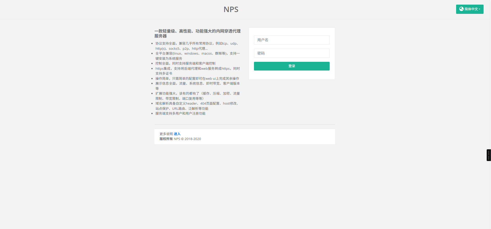
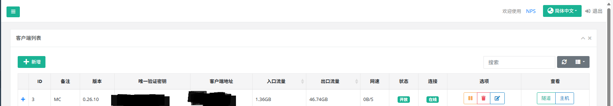

公网中转端，我们选择的是阿里云的公网服务器。
主要是因为它价格便宜（68r/year）
https://www.aliyun.com/
具体信息为：
Windows 2022 数据中心版 2vCPU 内存2GiB ESSD云盘:40GiB 公网宽带 200mbps
使用的原方案是[frp](https://github.com/fatedier/frp)
但是我发现我的frpc死活连不上于是就放弃了（可能是我太菜了）
后来我们的方案换成了[nps](https://github.com/ehang-io/nps)
这个的配置比较简单，于是我成功了
登录你的公网服务器IP:8080
就可以看见 这个页面
默认密码为admin 123
进去后点击客户端，点击新建客户端，剩下的默认。
这时候你就可以看见一个客户端了

点击加号你可以看到“客户端启动命令”
./npc.exe -server=xx.xx.xx.xx:8024 -vkey=xxxxx -type=tcp
这个时候你就可以在你要运行MC-server的服务器上安装npc了
还是这个项目[nps](https://github.com/ehang-io/nps)
下载他的release
解压
来到解压的文件夹。找到npc.conf
记得要配置好你的npc.conf
这个是我的,可以参考
之后再nps的网页控制端上，来到客户端，点击隧道。
按照你的npc.conf添加隧道
这个是我的可以参考

最后来到解压的文件夹，点击地址栏。
输入powershell.exe
在弹出的窗口中输入你的启动命令，即可连接到nps
至此网络传输就算完成了