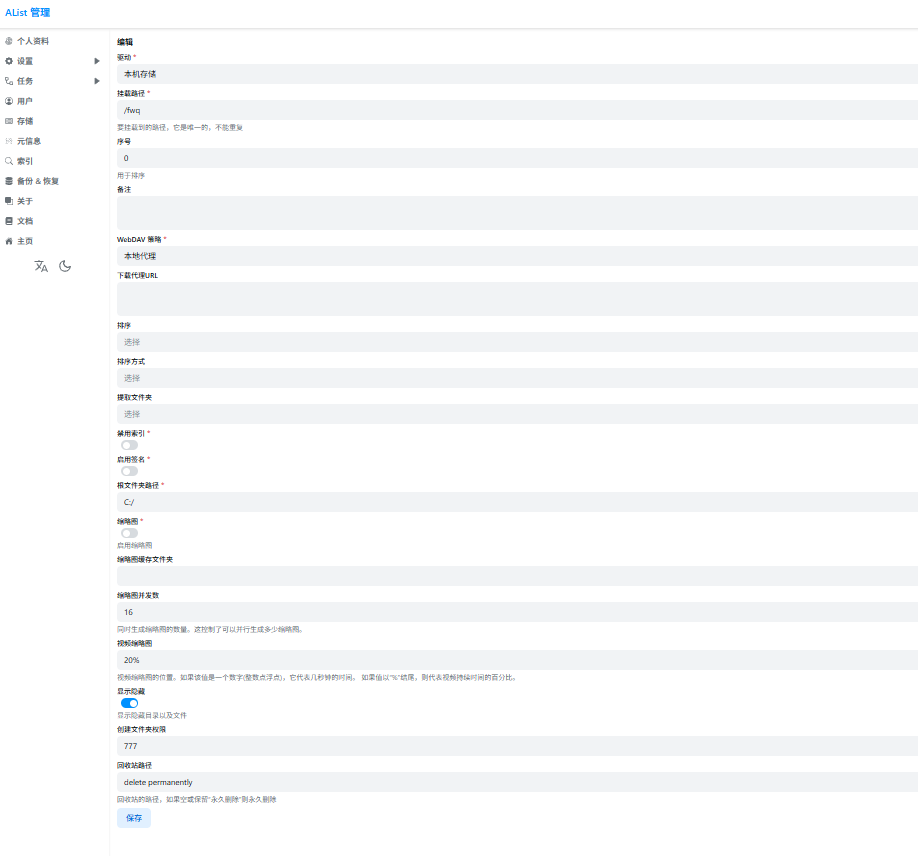

再你的控制端安装
之后选择手动添加 输入你中转服务器的公网ip，去你的MC-server端打开sunshin输入pin码就可以连接了，以后就不用验证了
文件管理我选择的是
安装再你的你MC-server端
然后我太懒了直接抄文档
# 解压下载的文件，得到可执行文件：
unzip alist-xxxx.zip
# 运行程序
.\alist.exe server

# 获得管理员信息 以下两个不同版本，新版本也有随机生成和手动设置
# 低于v3.25.0版本
.\alist.exe admin

# 高于v3.25.0版本
# 随机生成一个密码
.\alist.exe admin random
# 手动设置一个密码 `NEW_PASSWORD`是指你需要设置的密码
.\alist.exe admin set NEW_PASSWORD
之后登录你的alist
管理
存储，添加不对存储。
然后我太懒了直接抄文档。（不对！是我抄我自己）

之后就可以了